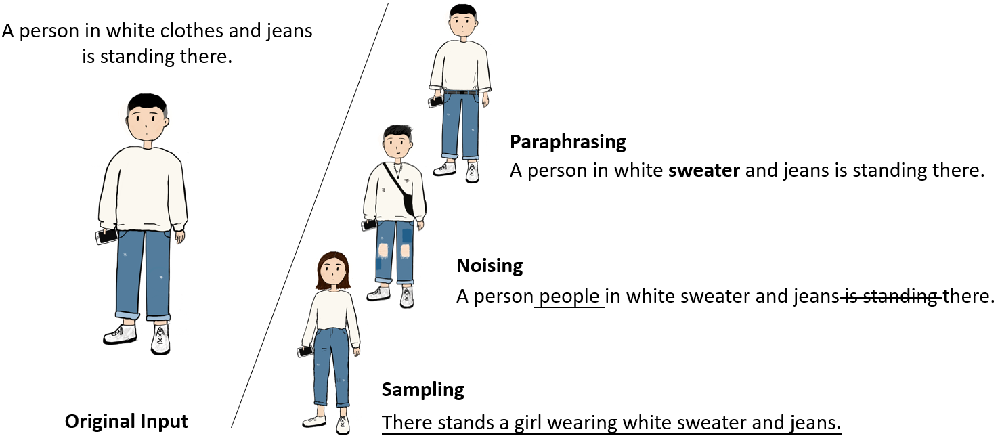

# Must-Read Papers on NLP Data Augmentation (DA) Methods

## Introduction

Data Augmentation methods have achieved great success in NLP recently. In this repo, we frame DA methods into three categories based on the **diversity** of augmented data, including *paraphrasing*, *noising*, and *sampling*.  [Here](https://github.com/BohanLi0110/NLP-DA-Papers/blob/main/DA_in_NLP.pdf) you can get the source paper for more details. Feel free to distribute or use it!

Corrections and suggestions are welcomed!




## Survey

**Data Augmentation Approaches in Natural Language Processing: A Survey**. *Bohan Li, Yutai Hou, Wanxiang Che*. arXiv:2106.07139 2021. [[pdf](https://arxiv.org/abs/2110.01852)]
```bib
@article{Li2021DataAA,
  title={Data Augmentation Approaches in Natural Language Processing: A Survey},
  author={Bohan Li and Yutai Hou and Wanxiang Che},
  journal={ArXiv},
  year={2021},
  volume={abs/2110.01852}

```

## Paraphrasing

### Thesauruses

1. **Character-level Convolutional Networks for Text Classification**. *Xiang Zhang, Junbo Zhao, Yann LeCun*. NIPS 2015. [[pdf](https://proceedings.neurips.cc/paper/2015/hash/250cf8b51c773f3f8dc8b4be867a9a02-Abstract.html)]
2. **Text Data Augmentation Made Simple By Leveraging NLP Cloud APIs**. *Claude Coulombe*. ArXiv 2018. [[pdf](http://arxiv.org/abs/1812.04718)]
3. **An Analysis of Simple Data Augmentation for Named Entity Recognition**. *Xiang Dai, Heike Adel*. COLING 2020. [[pdf](https://doi.org/10.18653/v1/2020.coling-main.343)]
4. **BLCU-NLP at SemEval-2020 Task 5: Data Augmentation for Efficient Counterfactual Detecting**. *Chang Liu, Dong Yu*. SEMEVAL 2020. [[pdf](https://aclanthology.org/2020.semeval-1.81)]
5. **Document-level multi-topic sentiment classification of Email data with BiLSTM and data augmentation**. *Sisi Liu, Kyungmi Lee, Ickjai Lee*. Knowl. Based Syst. 2020. [[pdf](https://doi.org/10.1016/j.knosys.2020.105918)]
6. **EDA: Easy Data Augmentation Techniques for Boosting Performance on Text Classification Tasks**. *Jason Wei, Kai Zou*. EMNLP 2019. [[pdf](https://doi.org/10.18653/v1/D19-1670)]
7. **How Effective is Task-Agnostic Data Augmentation for Pretrained Transformers?**. *Shayne Longpre, Yu Wang, Chris DuBois*. EMNLP Findings 2020. [[pdf](https://www.aclweb.org/anthology/2020.findings-emnlp.394)]
8. **KnowDis: Knowledge Enhanced Data Augmentation for Event Causality Detection via Distant Supervision**. *Xinyu Zuo, Yubo Chen, Kang Liu, Jun Zhao*. COLING 2020. [[pdf](https://doi.org/10.18653/v1/2020.coling-main.135)]
9. **On Data Augmentation for Extreme Multi-label Classification**. *Danqing Zhang, Tao Li, Haiyang Zhang, Bing Yin*. arXiv 2020. [[pdf](https://arxiv.org/abs/2009.10778)]
10. **WMD at SemEval-2020 Tasks 7 and 11: Assessing Humor and Propaganda Using Unsupervised Data Augmentation**. *Guillaume Daval-Frerot, Yannick Weis*. SEMEVAL 2020. [[pdf](https://www.aclweb.org/anthology/2020.semeval-1.246)]
### Embeddings

1. **That's So Annoying!!!: A Lexical and Frame-Semantic Embedding Based Data Augmentation Approach to Automatic Categorization of Annoying Behaviors using \#petpeeve Tweets**. *William Wang, Diyi Yang*. EMNLP 2015. [[pdf](https://doi.org/10.18653/v1/d15-1306)]
2. **Document-level multi-topic sentiment classification of Email data with BiLSTM and data augmentation**. *Sisi Liu, Kyungmi Lee, Ickjai Lee*. Knowl. Based Syst. 2020. [[pdf](https://doi.org/10.1016/j.knosys.2020.105918)]
### MLMs

1. **Data Augmentation for Low-Resource Neural Machine Translation**. *Marzieh Fadaee, Arianna Bisazza, Christof Monz*. ACL 2017. [[pdf](https://doi.org/10.18653/v1/P17-2090)]
2. **Contextual Augmentation: Data Augmentation by Words with Paradigmatic Relations**. *Sosuke Kobayashi*. NAACL-HLT 2018. [[pdf](https://doi.org/10.18653/v1/n18-2072)]
3. **Data Augmentation with Transformers for Text Classification**. *Jos\'e Tapia-T\'ellez, Hugo Escalante*. MICAI 2020. [[pdf](https://doi.org/10.1007/978-3-030-60887-3\_22)]
4. **Text Data Augmentation: Towards better detection of spear-phishing emails**. *Mehdi Regina, Maxime Meyer, S\'ebastien Goutal*. arXiv 2020. [[pdf](https://arxiv.org/abs/2007.02033)]
### Rules

1. **Text Data Augmentation Made Simple By Leveraging NLP Cloud APIs**. *Claude Coulombe*. ArXiv 2018. [[pdf](http://arxiv.org/abs/1812.04718)]
2. **Data Augmentation via Dependency Tree Morphing for Low-Resource Languages**. *G\"ozde Sahin, Mark Steedman*. arXiv 2019. [[pdf](http://arxiv.org/abs/1903.09460)]
3. **Simple is Better! Lightweight Data Augmentation for Low Resource Slot Filling and Intent Classification**. *Samuel Louvan, Bernardo Magnini*. PACLIC 2020. [[pdf](https://aclanthology.org/2020.paclic-1.20/)]
4. **Text Data Augmentation: Towards better detection of spear-phishing emails**. *Mehdi Regina, Maxime Meyer, S\'ebastien Goutal*. arXiv 2020. [[pdf](https://arxiv.org/abs/2007.02033)]
### MT

1. **Aggression Detection in Social Media: Using Deep Neural Networks, Data Augmentation, and Pseudo Labeling**. *Segun Aroyehun, Alexander Gelbukh*. TRAC@COLING 2018. [[pdf](https://aclanthology.org/W18-4411/)]
2. **QANet: Combining Local Convolution with Global Self-Attention for Reading Comprehension**. *Adams Yu, David Dohan, Minh-Thang Luong, Rui Zhao, Kai Chen, Mohammad Norouzi, Quoc Le*. ICLR 2018. [[pdf](https://openreview.net/forum?id=B14TlG-RW)]
3. **Text Data Augmentation Made Simple By Leveraging NLP Cloud APIs**. *Claude Coulombe*. ArXiv 2018. [[pdf](http://arxiv.org/abs/1812.04718)]
4. **Atalaya at TASS 2019: Data Augmentation and Robust Embeddings for Sentiment Analysis**. *Franco Luque*. IberLEF@SEPLN 2019. [[pdf](http://ceur-ws.org/Vol-2421/TASS\_paper\_1.pdf)]
5. **AlexU-BackTranslation-TL at SemEval-2020 Task 12: Improving Offensive Language Detection Using Data Augmentation and Transfer Learning**. *Mai Ibrahim, Marwan Torki, Nagwa El-Makky*. SEMEVAL 2020. [[pdf](https://aclanthology.org/2020.semeval-1.248)]
6. **BLCU-NLP at SemEval-2020 Task 5: Data Augmentation for Efficient Counterfactual Detecting**. *Chang Liu, Dong Yu*. SEMEVAL 2020. [[pdf](https://aclanthology.org/2020.semeval-1.81)]
7. **Can We Achieve More with Less? Exploring Data Augmentation for Toxic Comment Classification**. *Chetanya Rastogi, Nikka Mofid, Fang-I Hsiao*. arXiv 2020. [[pdf](https://arxiv.org/abs/2007.00875)]
8. **How Effective is Task-Agnostic Data Augmentation for Pretrained Transformers?**. *Shayne Longpre, Yu Wang, Chris DuBois*. EMNLP Findings 2020. [[pdf](https://www.aclweb.org/anthology/2020.findings-emnlp.394)]
9. **Improving Sentiment Analysis over non-English Tweets using Multilingual Transformers and Automatic Translation for Data-Augmentation**. *Valentin Barri\`ere, Alexandra Balahur*. COLING 2020. [[pdf](https://doi.org/10.18653/v1/2020.coling-main.23)]
10. **Improving Zero and Few-Shot Abstractive Summarization with Intermediate Fine-tuning and Data Augmentation**. *Alexander Fabbri, Simeng Han, Haoyuan Li, Haoran Li, Marjan Ghazvininejad, Shafiq Joty, Dragomir Radev, Yashar Mehdad*. NAACL-HLT 2021. [[pdf](https://doi.org/10.18653/v1/2021.naacl-main.57)]
11. **Multiple Data Augmentation Strategies for Improving Performance on Automatic Short Answer Scoring**. *Jiaqi Lun, Jia Zhu, Yong Tang, Min Yang*. AAAI 2020. [[pdf](https://aaai.org/ojs/index.php/AAAI/article/view/7062)]
12. **Parallel Data Augmentation for Formality Style Transfer**. *Yi Zhang, Tao Ge, Xu Sun*. ACL 2020. [[pdf](https://doi.org/10.18653/v1/2020.acl-main.294)]
13. **Text Data Augmentation: Towards better detection of spear-phishing emails**. *Mehdi Regina, Maxime Meyer, S\'ebastien Goutal*. arXiv 2020. [[pdf](https://arxiv.org/abs/2007.02033)]
14. **Unsupervised Data Augmentation for Consistency Training**. *Qizhe Xie, Zihang Dai, Eduard Hovy, Thang Luong, Quoc Le*. NeurIPS 2020. [[pdf](https://proceedings.neurips.cc/paper/2020/hash/44feb0096faa8326192570788b38c1d1-Abstract.html)]
15. **WMD at SemEval-2020 Tasks 7 and 11: Assessing Humor and Propaganda Using Unsupervised Data Augmentation**. *Guillaume Daval-Frerot, Yannick Weis*. SEMEVAL 2020. [[pdf](https://www.aclweb.org/anthology/2020.semeval-1.246)]
16. **Multilingual Transfer Learning for QA using Translation as Data Augmentation**. *Mihaela Bornea, Lin Pan, Sara Rosenthal, Radu Florian, Avirup Sil*. AAAI 2021. [[pdf](https://ojs.aaai.org/index.php/AAAI/article/view/17491)]

### Seq2Seq

1. **Sequence-to-Sequence Data Augmentation for Dialogue Language Understanding**. *Yutai Hou, Yijia Liu, Wanxiang Che, Ting Liu*. COLING 2018. [[pdf](https://aclanthology.org/C18-1105/)]
2. **Conditional Augmentation for Aspect Term Extraction via Masked Sequence-to-Sequence Generation**. *Kun Li, Chengbo Chen, Xiaojun Quan, Qing Ling, Yan Song*. ACL 2020. [[pdf](https://doi.org/10.18653/v1/2020.acl-main.631)]
3. **Data Augmentation for Multiclass Utterance Classification - A Systematic Study**. *Binxia Xu, Siyuan Qiu, Jie Zhang, Yafang Wang, Xiaoyu Shen, Gerard Melo*. COLING 2020. [[pdf](https://doi.org/10.18653/v1/2020.coling-main.479)]
4. **Dialog State Tracking with Reinforced Data Augmentation**. *Yichun Yin, Lifeng Shang, Xin Jiang, Xiao Chen, Qun Liu*. AAAI 2020. [[pdf](https://aaai.org/ojs/index.php/AAAI/article/view/6491)]
5. **Improving Grammatical Error Correction with Data Augmentation by Editing Latent Representation**. *Zhaohong Wan, Xiaojun Wan, Wenguang Wang*. COLING 2020. [[pdf](https://doi.org/10.18653/v1/2020.coling-main.200)]
6. **Tell Me How to Ask Again: Question Data Augmentation with Controllable Rewriting in Continuous Space**. *Dayiheng Liu, Yeyun Gong, Jie Fu, Yu Yan, Jiusheng Chen, Jiancheng Lv, Nan Duan, Ming Zhou*. EMNLP 2020. [[pdf](https://doi.org/10.18653/v1/2020.emnlp-main.467)]
7. **Variational Hierarchical Dialog Autoencoder for Dialog State Tracking Data Augmentation**. *Kang Yoo, Hanbit Lee, Franck Dernoncourt, Trung Bui, Walter Chang, Sang-goo Lee*. EMNLP 2020. [[pdf](https://doi.org/10.18653/v1/2020.emnlp-main.274)]
8. **C2C-GenDA: Cluster-to-Cluster Generation for Data Augmentation of Slot Filling**. *Yutai Hou, Sanyuan Chen, Wanxiang Che, Cheng Chen, Ting Liu*. AAAI 2021. [[pdf](https://ojs.aaai.org/index.php/AAAI/article/view/17540)]
9. **Data Augmentation for Hypernymy Detection**. *Thomas Kober, Julie Weeds, Lorenzo Bertolini, David Weir*. EACL 2021. [[pdf](https://aclanthology.org/2021.eacl-main.89/)]
## Noising

### Swapping

1. **Atalaya at TASS 2019: Data Augmentation and Robust Embeddings for Sentiment Analysis**. *Franco Luque*. IberLEF@SEPLN 2019. [[pdf](http://ceur-ws.org/Vol-2421/TASS\_paper\_1.pdf)]
2. **Data Augmentation for Deep Learning of Judgment Documents**. *Ge Yan, Yu Li, Shu Zhang, Zhenyu Chen*. IScIDE 2019. [[pdf](https://doi.org/10.1007/978-3-030-36204-1\_19)]
3. **EDA: Easy Data Augmentation Techniques for Boosting Performance on Text Classification Tasks**. *Jason Wei, Kai Zou*. EMNLP 2019. [[pdf](https://doi.org/10.18653/v1/D19-1670)]
4. **An Analysis of Simple Data Augmentation for Named Entity Recognition**. *Xiang Dai, Heike Adel*. COLING 2020. [[pdf](https://doi.org/10.18653/v1/2020.coling-main.343)]
5. **Can We Achieve More with Less? Exploring Data Augmentation for Toxic Comment Classification**. *Chetanya Rastogi, Nikka Mofid, Fang-I Hsiao*. arXiv 2020. [[pdf](https://arxiv.org/abs/2007.00875)]
6. **How Effective is Task-Agnostic Data Augmentation for Pretrained Transformers?**. *Shayne Longpre, Yu Wang, Chris DuBois*. EMNLP Findings 2020. [[pdf](https://www.aclweb.org/anthology/2020.findings-emnlp.394)]
7. **On Data Augmentation for Extreme Multi-label Classification**. *Danqing Zhang, Tao Li, Haiyang Zhang, Bing Yin*. arXiv 2020. [[pdf](https://arxiv.org/abs/2009.10778)]
### Deletion

1. **Data Augmentation for Deep Learning of Judgment Documents**. *Ge Yan, Yu Li, Shu Zhang, Zhenyu Chen*. IScIDE 2019. [[pdf](https://doi.org/10.1007/978-3-030-36204-1\_19)]
2. **EDA: Easy Data Augmentation Techniques for Boosting Performance on Text Classification Tasks**. *Jason Wei, Kai Zou*. EMNLP 2019. [[pdf](https://doi.org/10.18653/v1/D19-1670)]
3. **Hierarchical Data Augmentation and the Application in Text Classification**. *Shujuan Yu, Jie Yang, Danlei Liu, Runqi Li, Yun Zhang, Shengmei Zhao*. IEEE Access 2019. [[pdf](https://doi.org/10.1109/ACCESS.2019.2960263)]
4. **Can We Achieve More with Less? Exploring Data Augmentation for Toxic Comment Classification**. *Chetanya Rastogi, Nikka Mofid, Fang-I Hsiao*. arXiv 2020. [[pdf](https://arxiv.org/abs/2007.00875)]
5. **Data Augmentation for Spoken Language Understanding via Pretrained Models**. *Baolin Peng, Chenguang Zhu, Michael Zeng, Jianfeng Gao*. arXiv 2020. [[pdf](https://arxiv.org/abs/2004.13952)]
6. **How Effective is Task-Agnostic Data Augmentation for Pretrained Transformers?**. *Shayne Longpre, Yu Wang, Chris DuBois*. EMNLP Findings 2020. [[pdf](https://www.aclweb.org/anthology/2020.findings-emnlp.394)]
7. **On Data Augmentation for Extreme Multi-label Classification**. *Danqing Zhang, Tao Li, Haiyang Zhang, Bing Yin*. arXiv 2020. [[pdf](https://arxiv.org/abs/2009.10778)]
### Insertion

1. **EDA: Easy Data Augmentation Techniques for Boosting Performance on Text Classification Tasks**. *Jason Wei, Kai Zou*. EMNLP 2019. [[pdf](https://doi.org/10.18653/v1/D19-1670)]
2. **Can We Achieve More with Less? Exploring Data Augmentation for Toxic Comment Classification**. *Chetanya Rastogi, Nikka Mofid, Fang-I Hsiao*. arXiv 2020. [[pdf](https://arxiv.org/abs/2007.00875)]
3. **Data Augmentation for Spoken Language Understanding via Pretrained Models**. *Baolin Peng, Chenguang Zhu, Michael Zeng, Jianfeng Gao*. arXiv 2020. [[pdf](https://arxiv.org/abs/2004.13952)]
4. **How Effective is Task-Agnostic Data Augmentation for Pretrained Transformers?**. *Shayne Longpre, Yu Wang, Chris DuBois*. EMNLP Findings 2020. [[pdf](https://www.aclweb.org/anthology/2020.findings-emnlp.394)]
5. **On Data Augmentation for Extreme Multi-label Classification**. *Danqing Zhang, Tao Li, Haiyang Zhang, Bing Yin*. arXiv 2020. [[pdf](https://arxiv.org/abs/2009.10778)]
### Substitution

1. **Data Noising as Smoothing in Neural Network Language Models**. *Ziang Xie, Sida Wang, Jiwei Li, Daniel L\'evy, Aiming Nie, Dan Jurafsky, Andrew Ng*. ICLR 2017. [[pdf](https://openreview.net/forum?id=H1VyHY9gg)]
2. **SwitchOut: an Efficient Data Augmentation Algorithm for Neural Machine Translation**. *Xinyi Wang, Hieu Pham, Zihang Dai, Graham Neubig*. EMNLP 2018. [[pdf](https://doi.org/10.18653/v1/d18-1100)]
3. **Text Data Augmentation Made Simple By Leveraging NLP Cloud APIs**. *Claude Coulombe*. ArXiv 2018. [[pdf](http://arxiv.org/abs/1812.04718)]
4. **An Analysis of Simple Data Augmentation for Named Entity Recognition**. *Xiang Dai, Heike Adel*. COLING 2020. [[pdf](https://doi.org/10.18653/v1/2020.coling-main.343)]
5. **Data Augmentation for Spoken Language Understanding via Pretrained Models**. *Baolin Peng, Chenguang Zhu, Michael Zeng, Jianfeng Gao*. arXiv 2020. [[pdf](https://arxiv.org/abs/2004.13952)]
6. **Multiple Data Augmentation Strategies for Improving Performance on Automatic Short Answer Scoring**. *Jiaqi Lun, Jia Zhu, Yong Tang, Min Yang*. AAAI 2020. [[pdf](https://aaai.org/ojs/index.php/AAAI/article/view/7062)]
7. **Simple is Better! Lightweight Data Augmentation for Low Resource Slot Filling and Intent Classification**. *Samuel Louvan, Bernardo Magnini*. PACLIC 2020. [[pdf](https://aclanthology.org/2020.paclic-1.20/)]
8. **Text Data Augmentation: Towards better detection of spear-phishing emails**. *Mehdi Regina, Maxime Meyer, S\'ebastien Goutal*. arXiv 2020. [[pdf](https://arxiv.org/abs/2007.02033)]
9. **Unsupervised Data Augmentation for Consistency Training**. *Qizhe Xie, Zihang Dai, Eduard Hovy, Thang Luong, Quoc Le*. NeurIPS 2020. [[pdf](https://proceedings.neurips.cc/paper/2020/hash/44feb0096faa8326192570788b38c1d1-Abstract.html)]
10. **WMD at SemEval-2020 Tasks 7 and 11: Assessing Humor and Propaganda Using Unsupervised Data Augmentation**. *Guillaume Daval-Frerot, Yannick Weis*. SEMEVAL 2020. [[pdf](https://www.aclweb.org/anthology/2020.semeval-1.246)]
11. **Substructure Substitution: Structured Data Augmentation for NLP**. *Haoyue Shi, Karen Livescu, Kevin Gimpel*.  2021. [[pdf](https://doi.org/10.18653/v1/2021.findings-acl.307)]
### Mixup

1. **Augmenting Data with Mixup for Sentence Classification: An Empirical Study**. *Hongyu Guo, Yongyi Mao, Richong Zhang*. arXiv 2019. [[pdf](http://arxiv.org/abs/1905.08941)]
2. **AdvAug: Robust Adversarial Augmentation for Neural Machine Translation**. *Yong Cheng, Lu Jiang, Wolfgang Macherey, Jacob Eisenstein*. ACL 2020. [[pdf](https://doi.org/10.18653/v1/2020.acl-main.529)]
3. **Better Robustness by More Coverage: Adversarial Training with Mixup Augmentation for Robust Fine-tuning**. *Chenglei Si, Zhengyan Zhang, Fanchao Qi, Zhiyuan Liu, Yasheng Wang, Qun Liu, Maosong Sun*. arXiv 2020. [[pdf](https://arxiv.org/abs/2012.15699)]
4. **Local Additivity Based Data Augmentation for Semi-supervised NER**. *Jiaao Chen, Zhenghui Wang, Ran Tian, Zichao Yang, Diyi Yang*. EMNLP 2020. [[pdf](https://doi.org/10.18653/v1/2020.emnlp-main.95)]
5. **Mixup-Transformer: Dynamic Data Augmentation for NLP Tasks**. *Lichao Sun, Congying Xia, Wenpeng Yin, Tingting Liang, Philip Yu, Lifang He*. COLING 2020. [[pdf](https://doi.org/10.18653/v1/2020.coling-main.305)]
## Sampling

### Rules

1. **Improved relation classification by deep recurrent neural networks with data augmentation**. *Yan Xu, Ran Jia, Lili Mou, Ge Li, Yunchuan Chen, Yangyang Lu, Zhi Jin*. COLING 2016. [[pdf](https://aclanthology.org/C16-1138/)]
2. **AdvEntuRe: Adversarial Training for Textual Entailment with Knowledge-Guided Examples**. *Dongyeop Kang, Tushar Khot, Ashish Sabharwal, Eduard Hovy*. ACL 2018. [[pdf](https://aclanthology.org/P18-1225/)]
3. **Counterfactual Data Augmentation for Mitigating Gender Stereotypes in Languages with Rich Morphology**. *Ran Zmigrod, S. Mielke, Hanna Wallach, Ryan Cotterell*. ACL 2019. [[pdf](https://doi.org/10.18653/v1/p19-1161)]
4. **A multi-cascaded model with data augmentation for enhanced paraphrase detection in short texts**. *Muhammad Shakeel, Asim Karim, Imdadullah Khan*. Inf. Process. Manag. 2020. [[pdf](https://doi.org/10.1016/j.ipm.2020.102204)]
5. **Dialogue Distillation: Open-Domain Dialogue Augmentation Using Unpaired Data**. *Rongsheng Zhang, Yinhe Zheng, Jianzhi Shao, Xiaoxi Mao, Yadong Xi, Minlie Huang*. EMNLP 2020. [[pdf](https://doi.org/10.18653/v1/2020.emnlp-main.277)]
6. **Logic-Guided Data Augmentation and Regularization for Consistent Question Answering**. *Akari Asai, Hannaneh Hajishirzi*. ACL 2020. [[pdf](https://doi.org/10.18653/v1/2020.acl-main.499)]
7. **Multimodal Dialogue State Tracking By QA Approach with Data Augmentation**. *Xiangyang Mou, Brandyn Sigouin, Ian Steenstra, Hui Su*. arXiv 2020. [[pdf](https://arxiv.org/abs/2007.09903)]
8. **Multiple Data Augmentation Strategies for Improving Performance on Automatic Short Answer Scoring**. *Jiaqi Lun, Jia Zhu, Yong Tang, Min Yang*. AAAI 2020. [[pdf](https://aaai.org/ojs/index.php/AAAI/article/view/7062)]
9. **Syntactic Data Augmentation Increases Robustness to Inference Heuristics**. *Junghyun Min, R. McCoy, Dipanjan Das, Emily Pitler, Tal Linzen*. ACL 2020. [[pdf](https://doi.org/10.18653/v1/2020.acl-main.212)]
10. **Data Augmentation for Hypernymy Detection**. *Thomas Kober, Julie Weeds, Lorenzo Bertolini, David Weir*. EACL 2021. [[pdf](https://aclanthology.org/2021.eacl-main.89/)]
### Seq2Seq

1. **Improving Neural Machine Translation Models with Monolingual Data**. *Rico Sennrich, Barry Haddow, Alexandra Birch*. ACL 2016. [[pdf](https://doi.org/10.18653/v1/p16-1009)]
2. **AdvEntuRe: Adversarial Training for Textual Entailment with Knowledge-Guided Examples**. *Dongyeop Kang, Tushar Khot, Ashish Sabharwal, Eduard Hovy*. ACL 2018. [[pdf](https://aclanthology.org/P18-1225/)]
3. **Data Augmentation for Spoken Language Understanding via Joint Variational Generation**. *Kang Yoo, Youhyun Shin, Sang-goo Lee*. AAAI 2019. [[pdf](https://doi.org/10.1609/aaai.v33i01.33017402)]
4. **Domain Transfer based Data Augmentation for Neural Query Translation**. *Liang Yao, Baosong Yang, Haibo Zhang, Boxing Chen, Weihua Luo*. COLING 2020. [[pdf](https://doi.org/10.18653/v1/2020.coling-main.399)]
5. **Fast Cross-domain Data Augmentation through Neural Sentence Editing**. *Guillaume Raille, Sandra Djambazovska, Claudiu Musat*. arXiv 2020. [[pdf](https://arxiv.org/abs/2003.10254)]
6. **Forecasting emerging technologies using data augmentation and deep learning**. *Yuan Zhou, Fang Dong, Yufei Liu, Zhaofu Li, JunFei Du, Li Zhang*. Scientometrics 2020. [[pdf](https://doi.org/10.1007/s11192-020-03351-6)]
7. **Lexical-Constraint-Aware Neural Machine Translation via Data Augmentation**. *Guanhua Chen, Yun Chen, Yong Wang, Victor Li*. IJCAI 2020. [[pdf](https://doi.org/10.24963/ijcai.2020/496)]
8. **Parallel Data Augmentation for Formality Style Transfer**. *Yi Zhang, Tao Ge, Xu Sun*. ACL 2020. [[pdf](https://doi.org/10.18653/v1/2020.acl-main.294)]
9. **Pattern-aware Data Augmentation for Query Rewriting in Voice Assistant Systems**. *Yunmo Chen, Sixing Lu, Fan Yang, Xiaojiang Huang, Xing Fan, Chenlei Guo*. arXiv 2020. [[pdf](https://arxiv.org/abs/2012.11468)]
### Pretrained

1. **Data Augmentation for Spoken Language Understanding via Pretrained Models**. *Baolin Peng, Chenguang Zhu, Michael Zeng, Jianfeng Gao*. arXiv 2020. [[pdf](https://arxiv.org/abs/2004.13952)]
2. **Data Augmentation using Pre-trained Transformer Models**. *Varun Kumar, Ashutosh Choudhary, Eunah Cho*. arXiv 2020. [[pdf](https://arxiv.org/abs/2003.02245)]
3. **Data Boost: Text Data Augmentation Through Reinforcement Learning Guided Conditional Generation**. *Ruibo Liu, Guangxuan Xu, Chenyan Jia, Weicheng Ma, Lili Wang, Soroush Vosoughi*. EMNLP 2020. [[pdf](https://doi.org/10.18653/v1/2020.emnlp-main.726)]
4. **Deep Transformer based Data Augmentation with Subword Units for Morphologically Rich Online ASR**. *Bal\'azs Tarj\'an, Gy\"orgy Szasz\'ak, Tibor Fegy\'o, P\'eter Mihajlik*. arXiv 2020. [[pdf](https://arxiv.org/abs/2007.06949)]
5. **Do Not Have Enough Data? Deep Learning to the Rescue!**. *Ateret Anaby-Tavor, Boaz Carmeli, Esther Goldbraich, Amir Kantor, George Kour, Segev Shlomov, Naama Tepper, Naama Zwerdling*. AAAI 2020. [[pdf](https://aaai.org/ojs/index.php/AAAI/article/view/6233)]
6. **On Data Augmentation for Extreme Multi-label Classification**. *Danqing Zhang, Tao Li, Haiyang Zhang, Bing Yin*. arXiv 2020. [[pdf](https://arxiv.org/abs/2009.10778)]
7. **Pre-trained Data Augmentation for Text Classification**. *Hugo Abonizio, Sylvio Junior*. BRACIS 2020. [[pdf](https://doi.org/10.1007/978-3-030-61377-8\_38)]
8. **SSMBA: Self-Supervised Manifold Based Data Augmentation for Improving Out-of-Domain Robustness**. *Nathan Ng, Kyunghyun Cho, Marzyeh Ghassemi*. EMNLP 2020. [[pdf](https://doi.org/10.18653/v1/2020.emnlp-main.97)]
9. **Textual Data Augmentation for Efficient Active Learning on Tiny Datasets**. *Husam Quteineh, Spyridon Samothrakis, Richard Sutcliffe*. EMNLP 2020. [[pdf](https://doi.org/10.18653/v1/2020.emnlp-main.600)]
10. **Improving Commonsense Causal Reasoning by Adversarial Training and Data Augmentation**. *Ieva Staliunaite, Philip Gorinski, Ignacio Iacobacci*. AAAI 2021. [[pdf](https://ojs.aaai.org/index.php/AAAI/article/view/17630)]
### Self-training

1. **Augmentation-based Answer Type Classification of the SMART dataset**. *Aleksandr Perevalov, Andreas Both*. SMART@ISWC 2020. [[pdf](http://ceur-ws.org/Vol-2774/paper-01.pdf)]
2. **Denoising Pre-Training and Data Augmentation Strategies for Enhanced RDF Verbalization with Transformers**. *Sebastien Montella, Betty Fabre, Tanguy Urvoy, Johannes Heinecke, Lina Rojas-Barahona*. arXiv 2020. [[pdf](https://arxiv.org/abs/2012.00571)]
3. **Twitter Data Augmentation for Monitoring Public Opinion on COVID-19 Intervention Measures**. *Lin Miao, Mark Last, Marina Litvak*. NLP4COVID@EMNLP 2020. [[pdf](https://doi.org/10.18653/v1/2020.nlpcovid19-2.19)]
4. **Neural Retrieval for Question Answering with Cross-Attention Supervised Data Augmentation**. *Yinfei Yang, Ning Jin, Kuo Lin, Mandy Guo, Daniel Cer*. ACL/IJCNLP 2021. [[pdf](https://doi.org/10.18653/v1/2021.acl-short.35)]
5. **Self-training Improves Pre-training for Natural Language Understanding**. *Jingfei Du, Edouard Grave, Beliz Gunel, Vishrav Chaudhary, Onur Celebi, Michael Auli, Veselin Stoyanov, Alexis Conneau*. NAACL-HLT 2021. [[pdf](https://doi.org/10.18653/v1/2021.naacl-main.426)]
